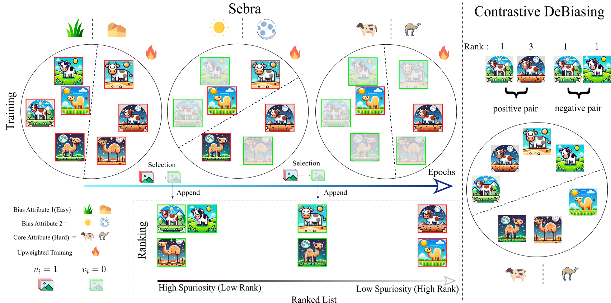

<div align="center">    
 
# Sebra: Debiasing through <u>Se</u>lf-Guided <u>B</u>ias <u>Ra</u>nking (ICLR 2025)

[](http://arxiv.org/abs/2501.18277)
[](https://kadarsh22.github.io/sebra_iclr25/)
[](https://wandb.ai/kadarsh22/Sebra)


</div>

## Table of Contents

- [Abstract](#abstract)
- [Installation](#installation)
- [Datasets](#datasets)
- [Training](#training)
- [Pretrained Models](#pretrained-models)
- [Updates](#updates)
- [Acknowledgements](#acknowledgements)
- [Citation](#citation)
- [License](#license)

---

## Abstract

Ranking samples by fine-grained estimates of spuriosity (the degree to which spurious cues are present) has recently been shown to significantly benefit bias mitigation, over the traditional binary biased-vs-unbiased partitioning of train sets. However, this spuriousity ranking comes with the requirement of human supervision. In this paper, we propose a debiasing framework based on our novel Self-Guided Bias Ranking (Sebra), that mitigates biases via an automatic ranking of data points by spuriosity within their respective classes. Sebra leverages a key local symmetry in Empirical Risk Minimization (ERM) training -- the ease of learning a sample via ERM inversely correlates with its spuriousity; the fewer spurious correlations a sample exhibits, the harder it is to learn, and vice versa. However, globally across iterations, ERM tends to deviate from this symmetry. Sebra dynamically steers ERM to correct this deviation, facilitating the sequential learning of attributes in increasing order of difficulty, ie, decreasing order of spuriosity. As a result, the sequence in which Sebra learns samples naturally provides spuriousity rankings. We use the resulting fine-grained bias characterization in a contrastive learning framework to mitigate biases from multiple sources. Extensive experiments show that Sebra consistently outperforms previous state-of-the-art unsupervised debiasing techniques across multiple standard benchmarks, including UrbanCars, BAR, and CelebA.

<p align="center">
  
</p>

---

## Installation

First, clone the repository and set up the environment:

```bash
git clone https://github.com/kadarsh22/sebra  # Clone the project
cd Sebra                                      # Navigate into the project directory
conda env create -f sebra.yml                 # Create a conda environment with dependencies
conda activate sebra                          # Activate the environment
```

---

## Datasets

You can generate or download the necessary datasets as described below:

- **CelebA**: Follow the instructions from [Echoes](https://github.com/isruihu/Echoes) to set up generate the dataset.
- **UrbanCars**: Follow the instructions from [Whack-A-mole-Dilemma](https://github.com/facebookresearch/Whac-A-Mole) to set up generate the dataset.
- **BAR**: Download the dataset from [BAR](https://github.com/simpleshinobu/IRMCon).
- **ImageNet-1K** : Download the dataset from [ImageNet-1K](https://image-net.org/download.php)

Once the datasets are ready, place them in a directory that is accessible by your project.

---

## Training

Run the following command to start training on the dataset of your choice:

```bash
bash scripts/$DATASET.sh
```

Replace `$DATASET` with one of the following options:
- `urbancars`
- `celeba`
- `bar`
- `imagenet`

For example, to run the training on bar:

```bash
bash scripts/bar.sh
```

---

## Pretrained Models

Pretrained models can be downloaded from [this Google Drive link](https://drive.google.com/drive/folders/18SrboWdenOYQiib7DkBs4x4-31aAJVb6?usp=sharing). 

---

## Updates

- **Janurary 22, 2025**: Paper accepted.
- **Janurary 29, 2025**: Code Release.

---

## Acknowledgements

This code is based on the open-source implementations from the following projects:
- [A Whac-A-Mole Dilemma: Shortcuts Come in Multiples Where Mitigating One Amplifies Others (CVPR 2023)](https://github.com/facebookresearch/Whac-A-Mole)
- [Echoes: Unsupervised Debiasing via Pseudo-bias Labeling in an Echo Chamber](https://github.com/isruihu/Echoes).

---

## Citation

If you find this code or idea useful, please cite our work: 

```bib
@misc{kappiyath2025sebradebiasingselfguidedbias,
      title={Sebra: Debiasing Through Self-Guided Bias Ranking}, 
      author={Adarsh Kappiyath and Abhra Chaudhuri and Ajay Jaiswal and Ziquan Liu and Yunpeng Li and Xiatian Zhu and Lu Yin},
      year={2025},
      eprint={2501.18277},
      archivePrefix={arXiv},
      primaryClass={cs.LG},
      url={https://arxiv.org/abs/2501.18277}, 
}

```


## License

This project is licensed under the MIT License - see the [LICENSE](LICENSE) file for details.
